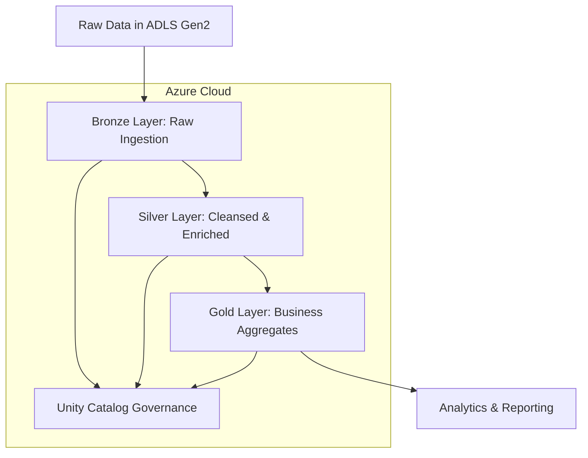

# 🏆 Databricks ETL Pipeline - Medallion Architecture

## 📊 Project Overview
This project implements a complete, production-grade data pipeline on Azure Databricks using the Medallion (Bronze-Silver-Gold) architecture. It processes raw retail data (Customers, Orders, Products, Regions) through incremental ingestion, transformation, and loading into analytics-ready tables with full historical tracking using Slowly Changing Dimensions Type 2.

## 🏗️ Architecture

## 🔧 Technical Implementation

### 🛠️ Tech Stack
- **Cloud Platform**: Microsoft Azure
- **Data Processing**: Azure Databricks, Apache Spark 3.5.0
- **Data Format**: Delta Lake
- **Data Governance**: Unity Catalog
- **Storage**: Azure Data Lake Storage Gen2 (ADLS Gen2)
- **Orchestration**: Databricks Workflows
- **Languages**: Python, SQL, PySpark

### 📋 Key Features
- **Incremental Processing**: Spark Structured Streaming with Autoloader
- **Schema Evolution**: Automatic handling of schema changes
- **Data Quality**: Built-in expectations and constraints
- **Historical Tracking**: SCD Type 2 implementation
- **Data Governance**: Unity Catalog with RBAC security

## 🚀 Layer Implementation

### Bronze Layer (Raw Ingestion)
- Incremental data ingestion using Databricks Autoloader
- Exactly-once processing through checkpointing
- Schema evolution handling
- Raw data preservation in Delta format

### Silver Layer (Cleansed & Enriched)
- Data validation and quality checks
- Transformation using PySpark functions
- Deduplication and data enrichment

### Gold Layer (Business Ready)
- Star schema implementation
- Slowly Changing Dimensions Type 2 using Delta Live Tables
- Analytics-ready tables for business intelligence

## 📊 Results
- Successfully processed 500+ records with incremental loading
- Implemented SCD Type 2 for historical data tracking
- Achieved data quality with expectation rules
- Automated end-to-end workflow orchestration
